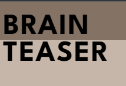
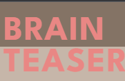

# BRAINTEASER

## WELCOME TO BRAINTEASER

### This site is developed with the intention to spread awareness about mental health.

In this section, you will include a few paragraphs providing an overview of your project.
Essentially, this part is your "sales pitch".

At this stage, you should have a name for your project so use it!
Don't introduce the project as a "portfolio project" for the diploma.

In this section, describe what the project hopes to accomplish, who it is intended to target, and how it will be useful to the target audience.

Screenshots for the README and testing should not be inside of `assets/` or `static/` image folders.
(reminder: `assets/` and `static/` are for files used on the live site, not documentation)
Consider adding a new folder called `documentation`, and add the amiresponsive screenshot inside of that folder.
To add the image into your README, use this format:
(assuming you have a new folder called `documentation` with an image called "mockup.png")

[Am I responsive web page](https://ui.dev/amiresponsive?url=https://jonathan97-web.github.io/Brainteaser/)

## UX

I have used a combination of grid and flex to get some of the elements where I needed them.

### Colour Scheme

- `#FFFFFF` used for primary headers and text in darker containers.
- `#e98784` used for text boxes with dark containers for high visibility and style.
- `#231F20` used for containers and headers in brighter containers.
- `#847365` used for backgrounds mainly.
- `#c6b6a9` used for main background mainly.  
  I used [coolors.co](https://coolors.co/c6b6a9-e98784-ffffff-231f20-847365) to generate my colour palette.  
  

### Typography

For Brainteaser I used Google Fonts as it is easy to use.

Example:

- [League Spartan](https://fonts.google.com/specimen/League+Spartan) was used for the primary headers and titles.

- [Barlow](https://fonts.google.com/specimen/Barlow) was used for all other secondary text.

- [Font Awesome](https://fontawesome.com) icons were used throughout the site, such as the social media icons in the footer.

## User Stories

In this section, list all of your user stories for the project.

### Site Users

- As a site user, I would like to navigate pages easily, so that I can find the information I need.
- As a site user, I would like to leave the website having gained more knowledge about my diagnosis,
so that I can understand it better.
- As a site user, I would like to , so that I can ____________.
- As a site user, I would like to ____________, so that I can ____________.
- As a site user, I would like to ____________, so that I can ____________.

### Returning Site Users

- As a returning site user, I would like to ____________, so that I can ____________.
- As a returning site user, I would like to ____________, so that I can ____________.
- As a returning site user, I would like to ____________, so that I can ____________.
- As a returning site user, I would like to ____________, so that I can ____________.
- As a returning site user, I would like to ____________, so that I can ____________.

### Site Admin

- As a site administrator, I should be able to ____________, so that I can ____________.
- As a site administrator, I should be able to ____________, so that I can ____________.
- As a site administrator, I should be able to ____________, so that I can ____________.
- As a site administrator, I should be able to ____________, so that I can ____________.
- As a site administrator, I should be able to ____________, so that I can ____________.

## Wireframes

I used Canva to design the wireframes for the website.   
[Canva website](https://www.canva.com/ 'Canva') 

### Unfortunately I didn't have enough time to recreate the website exactly as the wireframes

### Home and About Us Page Wireframes

| Size | Screenshot |
| --- | --- |
| Mobile | [Wireframe](/documentation/wireframes/wireframe-home-mobile.png) |
| Desktop | [Wireframe](documentation/wireframes/wireframe-home-desktop.png) |

### Sign-Up Page Wireframes

| Size | Screenshot |
| --- | --- |
| Mobile | [Wireframe](documentation/wireframes/wireframe-sign-up-mobile.png) |
| Desktop | [Wireframe](documentation/wireframes/wireframe-sign-up-desktop.png) |

### Tips & Tricks Page Wireframes

| Size | Screenshot |
| --- | --- |
| Mobile | [Wireframe](documentation/wireframes/wireframe-tips-tricks-mobile.png) |
| Desktop | [Wireframe](documentation/wireframes/wireframe-tips-tricks-desktop.png) |

### Diagnosis Page Wireframe

| Size | Screenshot |
| --- | --- |
| Mobile | [Wireframe](documentation/wireframes/wireframe-diagnosis-mobile.png) |
| Desktop | [Wireframe](documentation/wireframes/wireframe-diagnosis-desktop.png) |

## Features

In this section, you should go over the different parts of your project,
and describe each in a sentence or so.

You will need to explain what value each of the features provides for the user,
focusing on who this website is for, what it is that they want to achieve,
and how your project is the best way to help them achieve these things.

For some/all of your features, you may choose to reference the specific project files that implement them.

IMPORTANT: Remember to always include a screenshot of each individual feature!

### Existing Features

- **Hoverable header**

    - Header that changes the color from black to brighter pink when hovered over using :hover CSS.

- **Feature #2**

    - Details about this particular feature, including the value to the site, and benefit for the user. Be as detailed as possible!

- **Feature #3**

    - Details about this particular feature, including the value to the site, and benefit for the user. Be as detailed as possible!

Repeat as necessary for as many features as your site contains.

Hint: the more, the merrier!

### Future Features

- Hamburger menu for nav.
    - A fully interactive handburger menu, unfortunately this requires JavaScript.
- Contact page
    - Full contact page for users to interact with our team. (COMING SOON)
- Eye catching design on Diagnosis and Tips&Tricks pages.
    - Further design of the Diagnosis and Tips&Tricks as viewed in the wireframes. (COMING SOON)

## Tools & Technologies Used

In this section, you should explain the various tools and technologies used to develop the project.
Make sure to put a link (where applicable) to the source, and explain what each was used for.
Some examples have been provided, but this is just a sample only, your project might've used others.
Feel free to delete any unused items below as necessary.

- [HTML](https://en.wikipedia.org/wiki/HTML) used for the main site content.
- [CSS](https://en.wikipedia.org/wiki/CSS) used for the main site design and layout.
- [CSS :root variables](https://www.w3schools.com/css/css3_variables.asp) used for reusable styles throughout the site.
- [CSS Flexbox](https://www.w3schools.com/css/css3_flexbox.asp) and/or [CSS Grid](https://www.w3schools.com/css/css_grid.asp) used for an enhanced responsive layout.
- [Git](https://git-scm.com) used for version control. (`git add`, `git commit`, `git push`)
- [GitHub](https://github.com) used for secure online code storage.
- [Canva](https://canva.com) used for creation of the wireframes.
- [GitHub Pages](https://pages.github.com) used for hosting the deployed front-end site.
- [Gitpod](https://gitpod.io) used as a cloud-based IDE for development.
- [Markdown Builder by Tim Nelson](https://traveltimn.github.io/readme-builder) used to help generate the Markdown files.

## Testing

Here you can see the testing that was made for the website. [TESTING.md](TESTING.md)

## Deployment

The site was deployed to GitHub Pages. The steps to deploy are as follows:
- In the [GitHub repository](https://github.com/Jonathan97-web/my-full-template), navigate to the Settings tab 
- From the source section drop-down menu, select the **Main** Branch, then click "Save".
- The page will be automatically refreshed with a detailed ribbon display to indicate the successful deployment.

The live link can be found [here](https://jonathan97-web.github.io/my-full-template)

### Local Deployment

This project can be cloned or forked in order to make a local copy on your own system.

#### Cloning

You can clone the repository by following these steps:

1. Go to the [GitHub repository](https://github.com/Jonathan97-web/my-full-template) 
2. Locate the Code button above the list of files and click it 
3. Select if you prefer to clone using HTTPS, SSH, or GitHub CLI and click the copy button to copy the URL to your clipboard
4. Open Git Bash or Terminal
5. Change the current working directory to the one where you want the cloned directory
6. In your IDE Terminal, type the following command to clone my repository:
	- `git clone https://github.com/Jonathan97-web/my-full-template.git`
7. Press Enter to create your local clone.

Alternatively, if using Gitpod, you can click below to create your own workspace using this repository.

Please note that in order to directly open the project in Gitpod, you need to have the browser extension installed.
A tutorial on how to do that can be found [here](https://www.gitpod.io/docs/configure/user-settings/browser-extension).

#### Forking

By forking the GitHub Repository, we make a copy of the original repository on our GitHub account to view and/or make changes without affecting the original owner's repository.
You can fork this repository by using the following steps:

1. Log in to GitHub and locate the [GitHub Repository](https://github.com/Jonathan97-web/my-full-template)
2. At the top of the Repository (not top of page) just above the "Settings" Button on the menu, locate the "Fork" Button.
3. Once clicked, you should now have a copy of the original repository in your own GitHub account!

### Local VS Deployment

Use this space to discuss any differences between the local version you've developed, and the live deployment site on GitHub Pages.

## Credits

In this section you need to reference where you got your content, media, and extra help from.
It is common practice to use code from other repositories and tutorials,
however, it is important to be very specific about these sources to avoid plagiarism.

### Content

| Source | Location | Notes |
| --- | --- | --- |
| [Markdown Builder by Tim Nelson](https://traveltimn.github.io/readme-builder) | README and TESTING | tool to help generate the Markdown files |
| [Chris Beams](https://chris.beams.io/posts/git-commit) | version control | "How to Write a Git Commit Message" |
| [W3Schools](https://www.w3schools.com/howto/howto_css_modals.asp) | contact page | interactive pop-up (modal) |
| [W3Schools](https://www.w3schools.com/css/css3_variables.asp) | entire site | how to use CSS :root variables |
| [Flexbox Froggy](https://flexboxfroggy.com/) | entire site | modern responsive layouts |
| [Grid Garden](https://cssgridgarden.com) | entire site | modern responsive layouts |
| [StackOverflow](https://stackoverflow.com/a/2450976) | quiz page | Fisher-Yates/Knuth shuffle in JS |

### Media

Use this space to provide attribution links to any images, videos, or audio files borrowed from online.
A few examples have been provided below to give you some ideas.

If you're the owner (or a close acquaintance) of all media files, then make sure to specify this.
Let the assessors know that you have explicit rights to use the media files within your project.

Ideally, you should provide an actual link to every media file used, not just a generic link to the main site!
The list below is by no means exhaustive. Within the Code Institute Slack community, you can find more "free media" links
by sending yourself the following command: `!freemedia`.

| Source | Location | Type | Notes |
| --- | --- | --- | --- |
| [Canva](https://www.canva.com) | entire site | image | hero image and wireframe creation |

### Acknowledgements

Use this space to provide attribution to any supports that helped, encouraged, or supported you throughout the development stages of this project.
A few examples have been provided below to give you some ideas.

- I would like to thank my Code Institute mentor, [Tim Nelson](https://github.com/TravelTimN) for his excellent help and support during the development phase.
- I would like to thank the [Code Institute](https://codeinstitute.net) tutor team for their assistance with troubleshooting and debugging some project issues.
- I would like to thank the [Code Institute Slack community](https://code-institute-room.slack.com) for the moral support, great way to find answers to questions and the community is great.
- I would like to thank my partner Merle , for believing in me, helping me with the creation of the wireframes and allowing me to spend sleepless nights developing my project.
