# BRAINTEASER

[Link to live site!](https://jonathan97-web.github.io/Brainteaser)

## WELCOME TO BRAINTEASER

I developed this site mainly due to my personal connection with mental health issues.  

- Brainteaser is created to spread awareness about mental health diagnosises aswell as help people with their diagnosises.
- Subscribe to the monthly newsletter for news and updates about your diagnosis.
- Clean design with easy navigation tools.
- Brainteaser is both good looking and informative.

## UX

### Colour Scheme

- `#FFFFFF` used for primary headers and text in darker containers.
- `#e98784` used for text boxes with dark containers for high visibility and style.
- `#231F20` used for containers and headers in brighter containers.
- `#847365` used for backgrounds mainly.
- `#c6b6a9` used for main background.  
  I used [coolors.co](https://coolors.co/c6b6a9-e98784-ffffff-231f20-847365) to generate my colour palette.  
  

### Typography

For Brainteaser I used Google Fonts as it is easy to use and accessible.

Here are the links to the fonts and icons I've used:

- [League Spartan](https://fonts.google.com/specimen/League+Spartan) was used for the primary headers and titles.

- [Barlow](https://fonts.google.com/specimen/Barlow) was used for all other secondary text.

- [Font Awesome](https://fontawesome.com) icons were used throughout the site, such as the social media icons in the footer.

## Wireframes

I used Canva to design the wireframes for the website.
[Canva website](https://www.canva.com/ 'Canva')

### Home and About Us Page Wireframes

| Size | Screenshot |
| --- | --- |
| Mobile |  |
| Desktop | 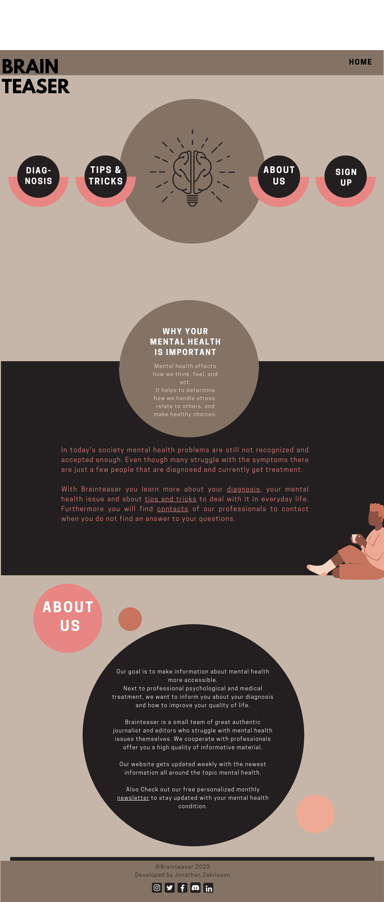 |

### Sign-Up Page Wireframes

| Size | Screenshot |
| --- | --- |
| Mobile | 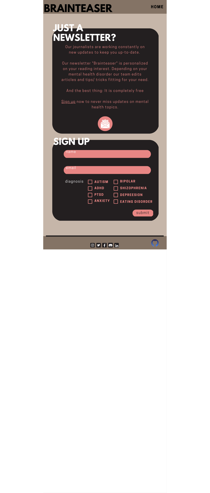 |
| Desktop | 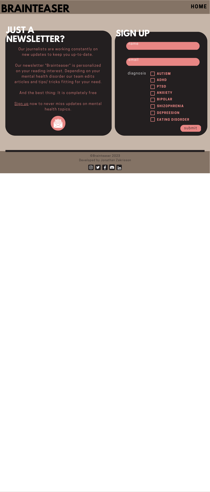 |

### Tips & Tricks Page Wireframes

| Size | Screenshot |
| --- | --- |
| Mobile | 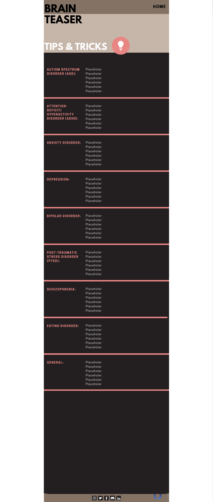 |
| Desktop | 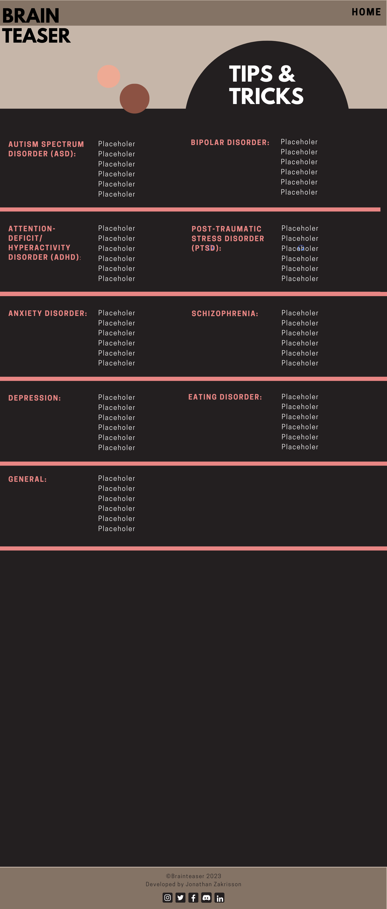 |

### Diagnosis Page Wireframe

| Size | Screenshot |
| --- | --- |
| Mobile | 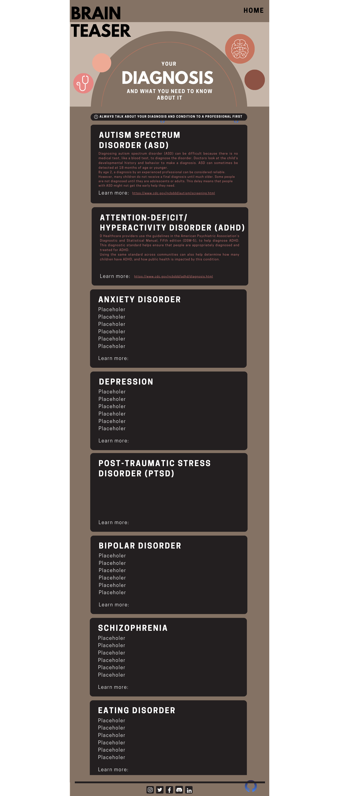 |
| Desktop | 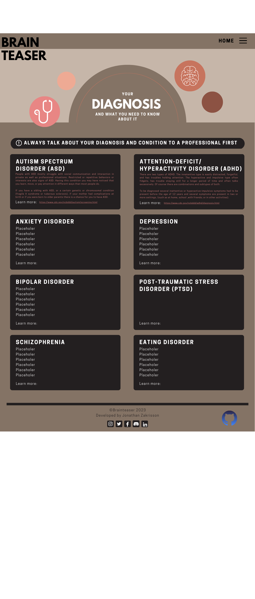 |

## Features

### Existing Features

- **Hoverable header**

- Header that changes the color from black to pink when hovered over using :hover CSS.
- On every page you can use it to get back to the homepage.

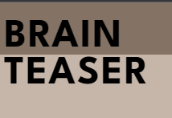
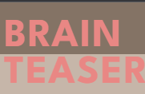

- **Responsive navigation and hero**
- Navigation and hero section with four circles and a image of a brain.
- The layout changes when you resize it to tablet/mobile viewports. (Try it!)
- The circles have a hover function which makes the white text pink when hovering over it.
- Instead of having the traditional navigation at the top of the page I found this to be more eye catching for the user. (only on the home page)
- By pressing the about us button you will be forwarded down to our about us section on the bottom of the index page.

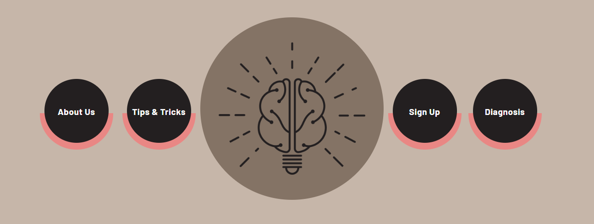
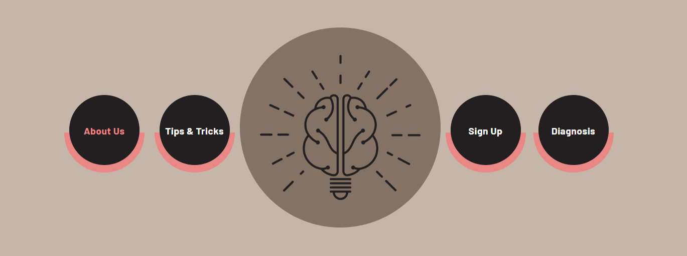

- **About Us Section**

- The about us section on the bottom of the homepage is made of a black circle with three other circles around it which makes it look like a solar system.
- The about us section is made to convey the goal of the team and why it was created.

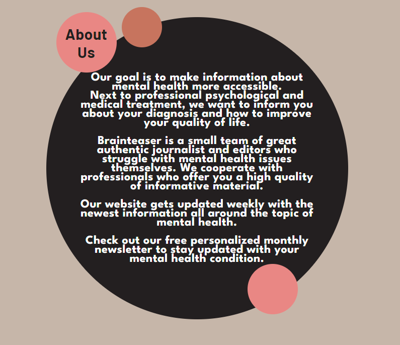

- **Sign Up Page**

- The Sign up page is made for signing up to the monthly newsletter on the webpage where the user recieves updates about their diagnosis.
- When Sign Up is pressed it will redirect you to a thank you page if you wait 10 seconds it will redirect you back to the homepage again.  

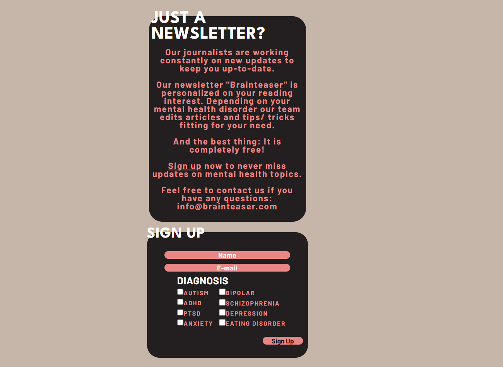

### Future Features

- A fully interactive hamburger menu, unfortunately this requires JavaScript.
- Contact page
- Full contact page for users to interact with our team. (COMING SOON)
- Further design of the Diagnosis and Tips&Tricks as viewed in the wireframes. (COMING SOON)

## Tools & Technologies Used

I used both grid and flex to flexibly put elements where I needed them.

- [HTML](https://en.wikipedia.org/wiki/HTML) used for the main site content.
- [CSS](https://en.wikipedia.org/wiki/CSS) used for the main site design and layout.
- [CSS :root variables](https://www.w3schools.com/css/css3_variables.asp) used for reusable styles throughout the site.
- [CSS Flexbox](https://www.w3schools.com/css/css3_flexbox.asp) and/or [CSS Grid](https://www.w3schools.com/css/css_grid.asp) used for an enhanced responsive layout.
- [Git](https://git-scm.com) used for version control. (`git add`, `git commit`, `git push`)
- [GitHub](https://github.com) used for secure online code storage.
- [Canva](https://canva.com) used for creation of the wireframes.
- [GitHub Pages](https://pages.github.com) used for hosting the deployed front-end site.
- [Gitpod](https://gitpod.io) used as a cloud-based IDE for development.
- [Markdown Builder by Tim Nelson](https://traveltimn.github.io/readme-builder) used to help generate the Markdown files.

## Testing

There is a seperate file for testing of the webpage with browser compability, lighthouse values etc.  
Press the link below to get redirected to the page.  
[TESTING.md](TESTING.md)

## Credits

### Content

| Source | Location | Notes |
| --- | --- | --- |
| [Markdown Builder by Tim Nelson](https://traveltimn.github.io/readme-builder) | README and TESTING | tool to help generate the Markdown files |
| [Chris Beams](https://chris.beams.io/posts/git-commit) | version control | "How to Write a Git Commit Message" |
| [W3Schools](https://www.w3schools.com/css/css3_variables.asp) | entire site | how to use CSS :root variables |
| [Flexbox Froggy](https://flexboxfroggy.com/) | entire site | was used to learn Flexbox layout and implementation |
| [Font Awesome](https://fontawesome.com/) | entire site | was used for the favicons I used in my footer at the bottom |
| [Google Fonts](https://fonts.google.com/) | entire site | was used for the fonts I used in my project |
| [W3Schools](https://www.w3schools.com/howto/howto_css_circles.asp) | entire site | was used to learn how to make perfect circles in CSS |
| [Tim Nelson](https://traveltimn.github.io) | entire site | Helped me make a :root calc() for my navigation circles and helped me with a bit of the media queries |

### Media

| Source | Location | Type | Notes |
| --- | --- | --- | --- |
| [Canva](https://www.canva.com) | entire site | image | hero image and wireframe creation |

### Acknowledgements

Thank you to everyone for all the help I have gotten during the development phase!

- I would like to thank my Code Institute mentor, [Tim Nelson](https://github.com/TravelTimN) for his excellent help and support during the development phase.
- I would like to thank the [Code Institute](https://codeinstitute.net) tutor team for their assistance with troubleshooting and debugging some project issues.
- I would like to thank the [Code Institute Slack community](https://code-institute-room.slack.com) for the moral support, great way to find answers to questions and the community is great.
- I would like to thank my partner Merle , for believing in me, helping me with the creation of the wireframes and allowing me to spend sleepless nights developing my project.
